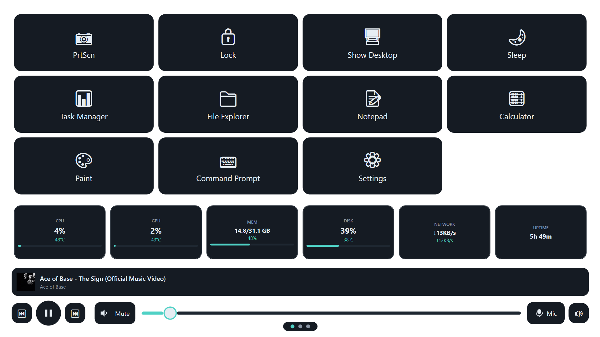
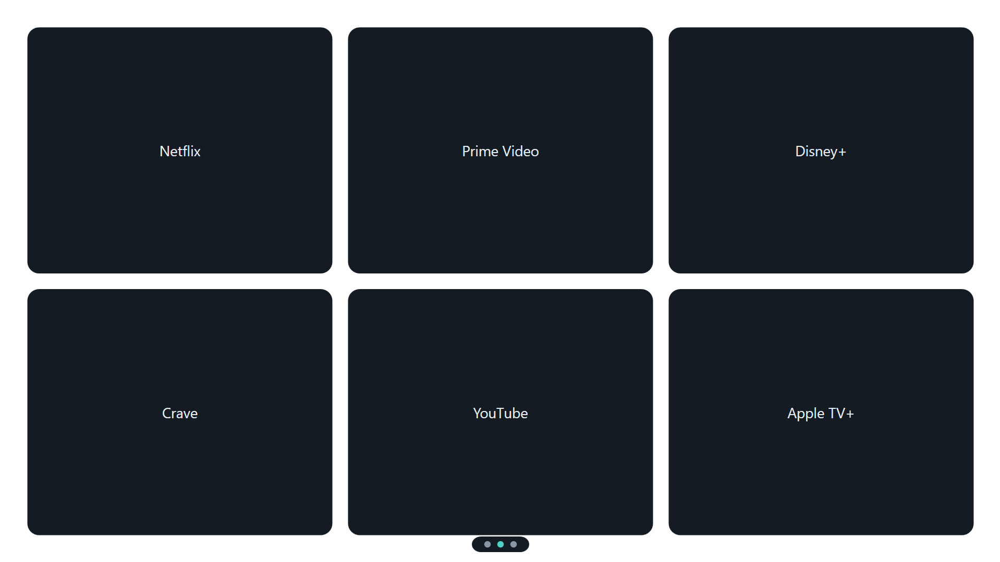

# ControlDeck

A custom WPF kiosk app for repurposing a spare touchscreen monitor as a second-display control
deck for a Windows PC: shortcuts, live system metrics, streaming services, and media/audio
controls, all swipeable by touch or mouse.

## Screenshots

### Shortcuts Page


### Streaming Page


## Features

- **Shortcuts pages**: a JSON-configurable grid of app launchers (run a command, or trigger a
  system action: lock, sleep, show desktop, print screen). Auto-paginates as entries are added.
  The first page also shows a live hardware metrics row (CPU/GPU load & temp, RAM, disk, network,
  uptime).
- **Streaming page**: a JSON-configurable picker grid of streaming services that opens into an
  embedded browser (WebView2) with native ad-block and popup-block filtering.
- **Wallpaper page**: a clock over a gradient background, or a custom image if you drop one in.
- **Shared media/control widget**, embedded at the bottom of every shortcuts page:
  - Now-playing title/artist/art, pulled from whatever's playing system-wide
  - Play/pause/skip transport controls
  - Volume slider + mute, auto-retargeting when you switch the active output device
  - Microphone mute toggle
  - Output device switcher: change Windows' default playback device from the kiosk itself
- **Touch and mouse swipe** between pages, with edge-reveal navigation arrows and a hidden
  close button that appears near the top edge.
- Runs borderless/topmost, positioned on whichever monitor you designate as the kiosk display.

## Requirements

- Windows 10 (1903+) or Windows 11
- [.NET 8 SDK](https://dotnet.microsoft.com/download/dotnet/8.0)
- Administrator rights at runtime (see below)

## Building and running

```
dotnet build ControlDeck.sln
dotnet run --project src\ControlDeck
```

The app manifest requests `requireAdministrator` (needed for `LibreHardwareMonitorLib` to read
full sensor data, since it loads a small kernel driver). Expect a UAC prompt.

**Dev note:** `dotnet run`/launching the built `.exe` directly goes through the apphost, which
enforces the manifest's elevation requirement and will prompt for UAC (or fail non-interactively).
Running the DLL directly via the shared host instead, `dotnet bin\Debug\net8.0-windows10.0.19041.0\ControlDeck.dll`,
bypasses that gate, which is useful for quick unelevated smoke tests; full sensor access needs the
elevated apphost path above.

## Configuration

On first run, ControlDeck writes one editable config file: `%LOCALAPPDATA%\ControlDeck\config.json`,
with three top-level sections:

- `AppLaunchers`: the shortcuts grid entries
- `StreamingServices`: the streaming service picker entries
- `DisplayDeviceName` / `DisplayNumber`: which monitor to run on (see below)

`wallpaper.jpg` (optional) can be dropped into the same folder to replace the default gradient on
the Wallpaper page.

Edit `config.json` directly; a restart picks up the changes. Each section falls back independently
to its own built-in defaults if it's missing or empty. If the whole file fails to parse, every
section falls back for that session, leaving the file on disk untouched.

The built-in `AppLaunchers`/`StreamingServices` defaults live in
[`src/ControlDeck/Assets/defaults.json`](src/ControlDeck/Assets/defaults.json). Edit it and rebuild
to change what ships out of the box.

### Choosing the kiosk display

Set `DisplayNumber` in `config.json` to the number of the monitor you want ControlDeck to run on.
Find it in Windows' Display Settings (click "Identify" to see each monitor's number), or use the
exact `DeviceName` (e.g. `\\.\DISPLAY2`) instead, which is checked first if both are set:

```json
{
  "AppLaunchers": [ ... ],
  "StreamingServices": [ ... ],
  "DisplayDeviceName": null,
  "DisplayNumber": 1
}
```

If neither is set, or the configured monitor is disconnected, ControlDeck falls back to the first
non-primary display, or the primary display if that's the only one available.

## Project layout

```
src/ControlDeck/
  App.xaml(.cs)              Application-wide styles/resources, startup
  MainWindow.xaml(.cs)       Hosts the swipeable page deck
  Assets/
    defaults.json            Built-in AppLaunchers/StreamingServices defaults
  Controls/
    SwipeContainer           Touch/mouse page-swipe host, page dots, edge-reveal nav arrows
    MediaWidget              Shared now-playing/transport/volume/mic/output-device controls
  Views/
    ShortcutsPage            App launcher grid + metrics row
    StreamingPage            Streaming service picker + embedded WebView2 browser
    WallpaperPage            Clock + background
  Services/
    ControlDeckConfig               config.json: shortcuts, streaming services, display selection
    AppLauncherService              Launching shortcuts (commands + system actions)
    AdBlockList                    WebView2 ad/tracker request filtering
    SystemActionsService           Lock/sleep/show desktop/print screen
    AudioService / MicrophoneService / AudioOutputService   System volume, mic mute, output switching
    HardwareMonitorService         CPU/GPU/RAM/disk/network sensors
    MediaSessionService            System-wide now-playing/transport control
    KioskWindowPlacementService    Positions the window on the target monitor, using ControlDeckConfig
```

## Auto-start at logon

Registered as a Task Scheduler entry, so it launches elevated automatically at logon. Build a
Release copy first, since that's what should run permanently:

```
dotnet build ControlDeck.sln -c Release
```

Then, from an **elevated** PowerShell (registering a task with `/rl highest` requires it):

```powershell
schtasks /create /tn "ControlDeck" /tr '"D:\git\ControlDeck\src\ControlDeck\bin\Release\net8.0-windows10.0.19041.0\ControlDeck.exe"' /sc onlogon /rl highest /f
```

Use single quotes around the `/tr` value as shown, so PowerShell passes the inner `"..."` through
literally to `schtasks`.

Verify it registered:

```powershell
schtasks /query /tn "ControlDeck" /v /fo list
```

Rebuilding Release after a code change updates the exe in place, so the registered task keeps
pointing at the current build automatically.
